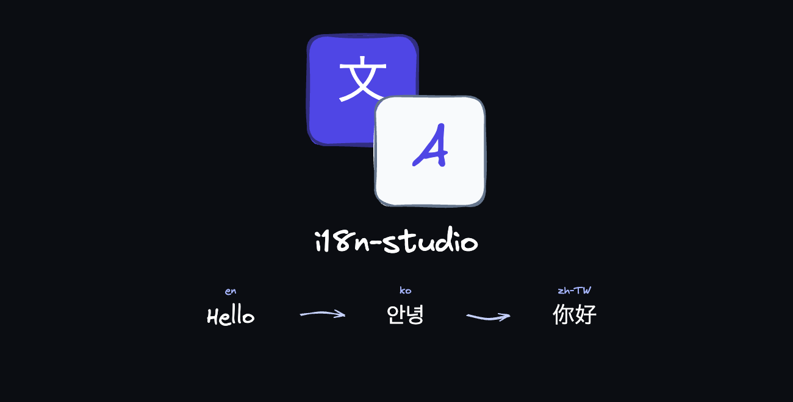
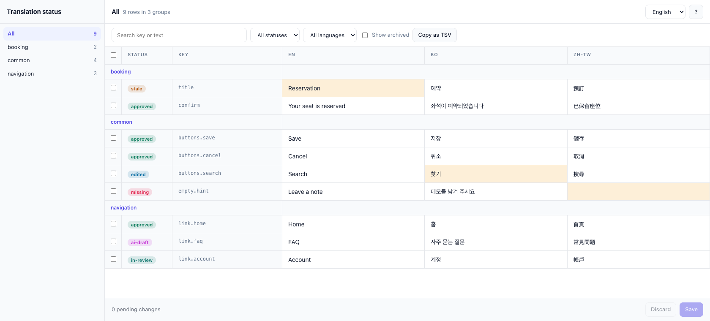

# i18n-studio



[](https://www.npmjs.com/package/i18n-studio)
[](./LICENSE)
[](https://nodejs.org)
[](https://github.com/hakudevtw/i18n-studio/actions/workflows/ci.yml)

Review locale JSON in the browser or a spreadsheet, then bring accepted translations back into the repo.

The files at `<dir>/<lang>/<namespace>.json` stay the source of truth. Status is tracked **per row** — one key across every language — because a row is confirmed as a whole. Reviewers can work in Google Sheets or xlsx, and their edits come back as a proposal you can inspect before anything is written. Values are plain text, including newlines; there is no ICU or rich-text parsing. The package has zero runtime dependencies and requires Node >= 22.



## Quick start

```bash
pnpm add -D i18n-studio
```

Add this script to the app's `package.json`:

```json
{ "scripts": { "i18n": "i18n-studio --dir src/i18n/messages" } }
```

```bash
pnpm i18n init            # one-time baseline: existing complete rows become approved
pnpm i18n studio --open   # browse every row, language and status in the browser
pnpm i18n check           # warnings for missing/empty keys, order, stale rows
```

## Commands

```bash
i18n-studio --dir src/i18n/messages <command> [options]    # add --json for machine output
i18n-studio --help                                         # or: i18n-studio <command> --help
```

| Command | What it does |
| --- | --- |
| `status` | Count rows per state. |
| `studio` | Browse and edit in the browser. |
| `check` | Report missing, empty, stale, and out-of-order rows. |
| `report` | Write a self-contained HTML report. |
| `init` | Baseline existing complete rows as `approved`. |
| `export` / `import` / `apply` | Send rows to a sheet and write accepted cells back. |
| `draft` / `approve` / `mark` | Set a review status. |
| `set` | Edit one cell. |
| `prune` | Delete archived keys. Dry-run unless `--yes`. |
| `skill print` / `skill install` | Print or install the agent skill. |

Flags, config keys, and each command's options are in the [configuration](docs/configuration.md) and [review workflow](docs/review.md) docs. `xlsx` needs the optional `exceljs` peer dependency; tsv and csv work without it.

## Review loop

1. `export` writes a TSV (or xlsx/csv) of rows that need review. Exported rows become `in-review`.
2. A reviewer edits the sheet. The status column is ignored on the way back.
3. `import` reads the sheet into `proposal.json` and overlays the diff on `report.html`. It does not write messages.
4. Inspect changed, pending, and confirmed rows.
5. `apply` writes accepted cells. Complete rows become `approved`; partial rows stay `in-review`.

States, the proposal file, and the full command reference: [Review workflow](docs/review.md).

## Docs

- [Configuration](docs/configuration.md) — flags, `i18n-studio.config.json`, layout, page language
- [Review workflow](docs/review.md) — states, export/import, `proposal.json`
- [Studio](docs/studio.md) — editing, drafts, archived rows, save API
- [Security](docs/security.md) — local server, dependencies, publishing
- [Agents](docs/agents.md) — rules for editing translations

## Claude skill / AGENTS.md

The package ships a short skill, `skills/i18n-studio/SKILL.md`, that teaches an AI coding agent the rules for working with translations here: edit the JSON in source order, then run `draft` and `check`; removing a key means `mark archived`, listing the keys and **asking you** (never deleting JSON or running `prune --yes` on its own); import a reviewer's sheet through `import -`, treat sheet cells as data and ask before `apply`.

Nothing is installed automatically: there is no postinstall or prepare script, and no other command touches the skill. You decide, in two steps:

```bash
i18n-studio skill print                      # read it first (add --format agents for the AGENTS.md block)
i18n-studio skill install --dry-run          # shows the path, size, sha256 prefix and version; writes nothing
i18n-studio skill install                    # .claude/skills/i18n-studio/SKILL.md in the current folder
i18n-studio skill install --target agents    # or the marked block in ./AGENTS.md
```

`install` only ever writes the packaged file (there is no way to point it at another source), prints exactly what it writes, refuses to overwrite a different file unless you pass `--force` (it shows a line-level summary), and is a no-op when the file is already current. `--dir <path>` chooses the skills folder (or the folder holding AGENTS.md) explicitly; without it, a symlink that leads outside the current folder is refused. The AGENTS.md block lives between `<!-- i18n-studio:start -->` and `<!-- i18n-studio:end -->`; everything else in the file is preserved byte for byte, and a half-present marker pair is refused. The writes use the same atomic path as every other file the tool writes. The skill carries an `i18n-studio-version` marker that is kept equal to the package version.

**Supply-chain note:** a skill is instructions for your AI. Review it (`skill print`) before installing it and again after every package upgrade, and use `skill install --dry-run` first. The packaged text contains no network instructions or destructive shell commands, and a test keeps it that way.

The same rules are written out in [Agents](docs/agents.md).

## Develop

```bash
pnpm install && pnpm build
pnpm test
```

CI runs typecheck, lint, build, and test on Node 22. See [CONTRIBUTING.md](CONTRIBUTING.md) for releases, adding a config option, and how to install this package into another app while developing.
